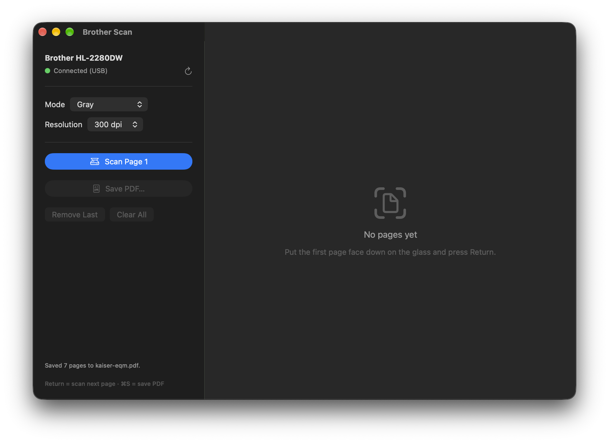

# Brother HL-2280DW scanning on Apple Silicon

Brother dropped macOS scanner support for the HL-2280DW. This project gets the
flatbed working again on an M-series Mac over USB, using an open-source driver,
and wraps it in a small app that scans pages one at a time into a single PDF.



## How it works

- **Driver:** Ralph Little's open-source `brother_mfp` backend for SANE
  (a draft merge request to sane-backends, not yet released). It speaks the
  Brother scan protocol over `libusb`, so it runs natively on Apple Silicon.
  `driver/brother_mfp-hl2280dw.patch` adds the HL-2280DW model entry and fixes
  end-of-page detection for this generation of Brother lasers.
  `driver/build-driver.sh` builds it into `sane-prefix/` (only that backend,
  plus the `scanimage` tool).
- **App:** `BrotherScan.app` is a SwiftUI app (built with `swiftc`, no Xcode
  project). `scan-cli` is a terminal version. Both run `scanimage` per page and
  write one PDF with Core Graphics. Gray/color pages are JPEG-compressed in the
  PDF; black-and-white pages stay lossless.

## Setup

```sh
./driver/build-driver.sh   # installs Homebrew deps, builds the driver into sane-prefix/
./build-app.sh             # builds BrotherScan.app and scan-cli
```

The driver is built with absolute paths into `sane-prefix/`, so keep the
project folder where it is (or rebuild after moving it).

## Scanning a multi-page document

**GUI:** `open BrotherScan.app`. Put a page on the glass, press Return (or
click "Scan Page"), repeat for each page, then ⌘S to save the PDF.

**Terminal:**

```sh
./scan-cli --mode gray --dpi 300 --pages 8 document.pdf   # press Return per page
./scan-cli document.pdf                                    # type "done" when finished
```

Modes: `bw` (smallest files, fine for text), `gray` (default), `color`.
Resolutions: 100, 150, 200, 300 (default), 600.

## Notes

- Flatbed only: the HL-2280DW has no document feeder.
- Usable scan area is 215.9 × 290 mm; the glass does not quite reach 297 mm.
- If the printer stops responding after an interrupted scan, power-cycle it.
- Raw access: `sane-prefix/bin/scanimage -L` lists the device;
  `sane-prefix/bin/scanimage --mode Gray --resolution 300 -y 290 --format=png -o page.png`
  scans one page. `SANE_DEBUG_BROTHER_MFP=5` turns on driver logging.

## Sources and credits

- [brother_mfp SANE backend](https://gitlab.com/sane-project/backends/-/merge_requests/751)
  by Ralph Little: the open-source driver this project builds on (draft merge
  request to sane-backends, branch `brother_mfp_backend`, commit `641b756`).
- [Brother brscan4 Linux driver](https://download.brother.com/welcome/dlf105200/brscan4-0.4.11-1.amd64.deb):
  source of the HL-2280DW model parameters (USB product id `0x0272`, model type 14).
- [dmikushin/brscan](https://github.com/dmikushin/brscan): reverse-engineered
  brscan3/brscan4 protocol notes, useful for understanding the block framing.
- [SANE project](http://www.sane-project.org/): `scanimage` and the backend
  framework.

## License

The driver patch applies to sane-backends, which is GPL-2.0-or-later with the
SANE exception; the patch is offered under the same terms. The Swift sources
and scripts in this repository are MIT licensed.
